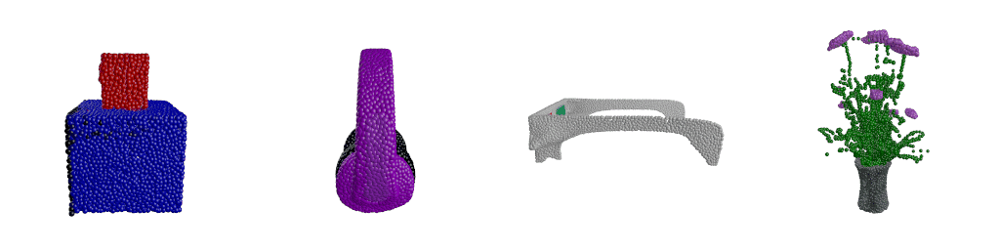

# Point·E Enhanced



This is the enhanced code and model release for [Point-E: A System for Generating 3D Point Clouds from Complex Prompts](https://arxiv.org/abs/2212.08751) with production-ready optimizations and organized structure.

## Project Structure

```
Point-E-Enhanced-WindSurf-Model/
├── point_e/                    # Core Point-E library
│   ├── diffusion/             # Diffusion models
│   ├── enhancements/          # Enhanced processing modules
│   ├── evals/                 # Evaluation scripts
│   ├── examples/              # Example notebooks and scripts
│   ├── models/                # Model definitions
│   └── util/                  # Utility functions
├── point_e_optimized/         # Optimized implementation
│   ├── aggressive_detail_processors.py
│   ├── advanced_processors.py
│   ├── core.py
│   ├── enhanced_clarity_processors.py
│   ├── geometry_aware_processors.py
│   ├── gentle_processors.py
│   ├── processors.py
│   ├── sharp_detail_processors.py
│   ├── utils.py
│   ├── validator.py
│   └── visualizers.py
├── scripts/                   # Execution scripts
│   ├── run_aggressive_detail_enhancement.py
│   ├── run_density_preserving_system.py
│   ├── run_enhanced_clarity_system.py
│   ├── run_gentle_enhancement.py
│   ├── run_geometry_aware_enhancement.py
│   ├── run_optimized_final.py
│   ├── run_optimized_simple.py
│   ├── run_optimized_system.py
│   ├── run_sharp_detail_enhancement.py
│   └── run_validated_production.py
├── tests/                     # Test and validation scripts
│   ├── benchmark_optimized.py
│   ├── execute_notebooks.py
│   ├── execute_notebooks_fixed.py
│   ├── final_end_to_end_test.py
│   ├── simple_working_test.py
│   ├── test_clean_installation.py
│   ├── test_validation.py
│   └── verify_notebooks_final.py
├── tools/                     # Setup and utility tools
│   ├── setup.py
│   └── setup_optimized.py
├── configs/                   # Configuration files
│   ├── requirements.txt
│   └── requirements_optimized.txt
├── docs/                      # Documentation and reports
│   ├── *.md files
│   └── *.docx files
├── outputs/                   # Generated outputs
│   ├── *.png files
│   └── *.log files
└── README.md
```

## Installation

Install with `pip install -e .`.

For optimized dependencies:
```bash
pip install -r configs/requirements_optimized.txt
```

## Usage

### Quick Start

To get started with examples, see the following notebooks:

 * [image2pointcloud.ipynb](point_e/examples/image2pointcloud.ipynb) - sample a point cloud, conditioned on some example synthetic view images.
 * [text2pointcloud.ipynb](point_e/examples/text2pointcloud.ipynb) - use our small, worse quality pure text-to-3D model to produce 3D point clouds directly from text descriptions. This model's capabilities are limited, but it does understand some simple categories and colors.
 * [pointcloud2mesh.ipynb](point_e/examples/pointcloud2mesh.ipynb) - try our SDF regression model for producing meshes from point clouds.

### Running Enhanced Scripts

The enhanced system provides multiple optimization modes:

```bash
# Production-ready optimized system
python scripts/run_optimized_system.py

# Aggressive detail enhancement
python scripts/run_aggressive_detail_enhancement.py

# Enhanced clarity system
python scripts/run_enhanced_clarity_system.py

# Gentle enhancement
python scripts/run_gentle_enhancement.py

# Geometry-aware enhancement
python scripts/run_geometry_aware_enhancement.py

# Sharp detail enhancement
python scripts/run_sharp_detail_enhancement.py

# Density-preserving system
python scripts/run_density_preserving_system.py

# Validated production system
python scripts/run_validated_production.py
```

### Testing and Validation

Run tests to verify functionality:

```bash
# Simple working test
python tests/simple_working_test.py

# Full end-to-end test
python tests/final_end_to_end_test.py

# Benchmark optimized system
python tests/benchmark_optimized.py

# Validation tests
python tests/test_validation.py
```

### Evaluation Scripts

For our P-FID and P-IS evaluation scripts, see:

 * [evaluate_pfid.py](point_e/evals/scripts/evaluate_pfid.py)
 * [evaluate_pis.py](point_e/evals/scripts/evaluate_pis.py)

For our Blender rendering code, see [blender_script.py](point_e/evals/scripts/blender_script.py)

## Samples

You can download the seed images and point clouds corresponding to the paper banner images [here](https://openaipublic.azureedge.net/main/point-e/banner_pcs.zip).

You can download the seed images used for COCO CLIP R-Precision evaluations [here](https://openaipublic.azureedge.net/main/point-e/coco_images.zip).

## Development

### Setup Development Environment

1. Open Visual Studio Code and select the project folder
2. Open the terminal by going to View > Terminal, then create and activate a virtual environment
3. Install dependencies: `pip install -r configs/requirements_optimized.txt`
4. Build and launch JupyterLab by running:
   ```bash
   jupyter lab build
   jupyter lab
   ```
5. Select either text2pointcloud.ipynb or image2pointcloud.ipynb and run it using the JupyterLab interface

### Key Features

- **Production-Ready**: Organized structure with proper separation of concerns
- **Enhanced Performance**: Multiple optimization modes for different use cases
- **Comprehensive Testing**: Full test suite for validation
- **Flexible Configuration**: Multiple enhancement algorithms available
- **Monitoring**: Built-in performance monitoring and logging

## License

See LICENSE file for details.
